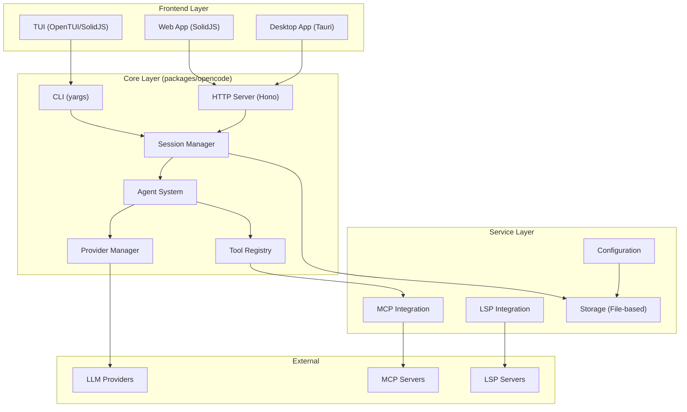
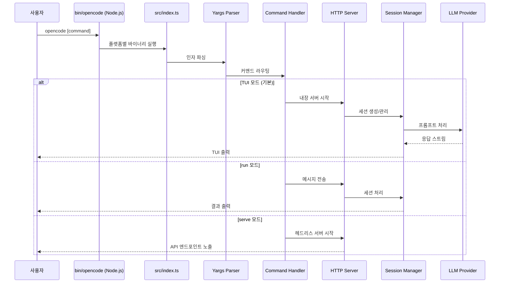
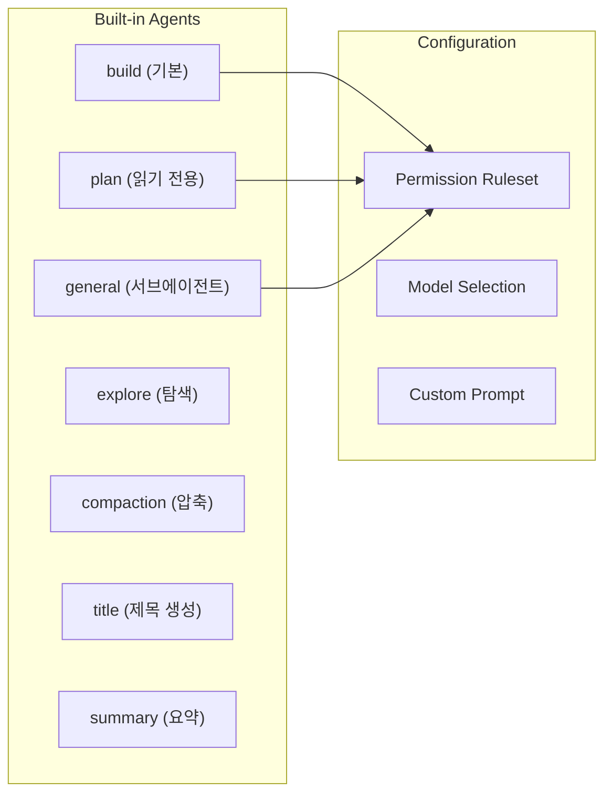
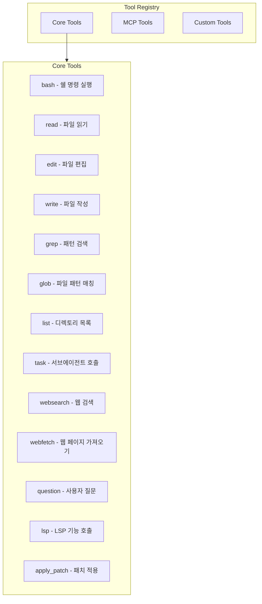
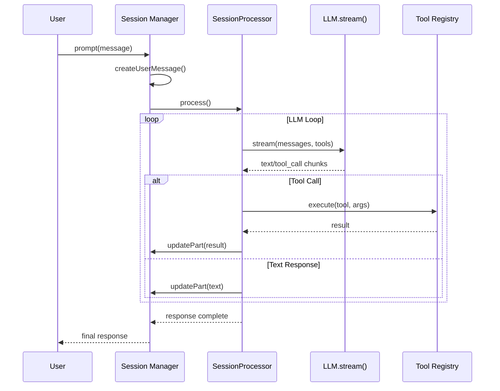
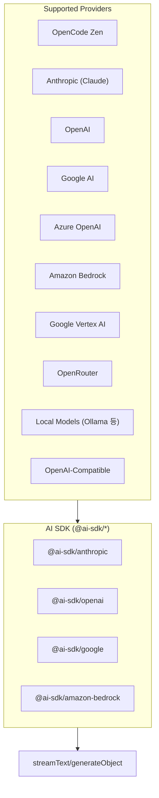
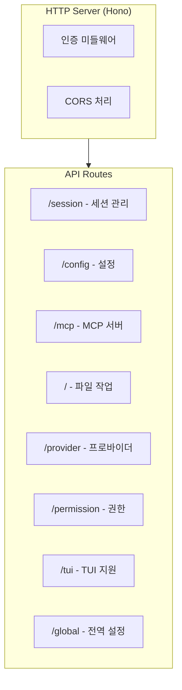
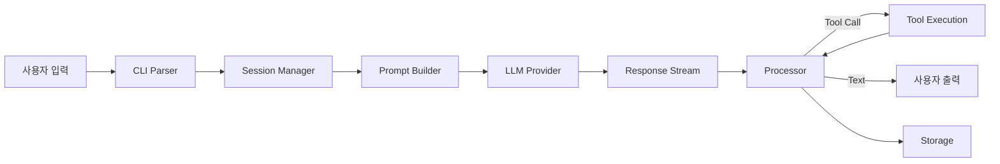

# OpenCode 프로젝트 분석 문서

## 1. 프로젝트 개요

OpenCode는 100% 오픈소스 AI 코딩 어시스턴트로, Claude Code와 유사한 CLI 형태의 도구입니다. Bun 런타임 기반으로 개발되었으며, 다양한 LLM 프로바이더를 지원하는 특징을 가집니다.

### 핵심 특징
- **100% 오픈소스**: MIT 라이선스
- **프로바이더 독립적**: Claude, OpenAI, Google, 로컬 모델 등 다양한 LLM 지원
- **LSP 지원**: 기본 LSP(Language Server Protocol) 통합
- **TUI 중심 설계**: Neovim 사용자 친화적 터미널 UI
- **클라이언트/서버 아키텍처**: 원격 접속 및 다양한 클라이언트 지원

---

## 2. 전체 아키텍처



### 주요 패키지 구조

```
opencode/
├── packages/
│   ├── opencode/           # 핵심 엔진 (CLI, Server, Agent, Tools)
│   ├── app/                # 공유 Web UI 컴포넌트 (SolidJS)
│   ├── desktop/            # 데스크톱 앱 (Tauri + SolidJS)
│   ├── console/            # 웹 콘솔 UI
│   ├── sdk/                # JavaScript SDK
│   ├── plugin/             # 플러그인 시스템 (@opencode-ai/plugin)
│   └── ui/                 # 공통 UI 컴포넌트
```

---

## 3. 엔트리 포인트 및 실행 흐름

### 3.1 사용자 실행 시작점



### 3.2 엔트리 포인트: `packages/opencode/src/index.ts`

```typescript
// CLI 진입점 (yargs 기반)
const cli = yargs()
  .command(RunCommand)      // opencode run [message]
  .command(ServeCommand)    // opencode serve (headless server)
  .command(TuiThreadCommand) // 기본 TUI 모드
  .command(AuthCommand)     // 인증 관리
  .command(AgentCommand)    // 에이전트 관리
  .command(McpCommand)      // MCP 서버 관리
  // ... 기타 커맨드
```

### 3.3 실행 모드

| 모드 | 명령어 | 설명 |
|------|--------|------|
| **TUI** | `opencode` | 기본 터미널 UI 모드 |
| **Run** | `opencode run "message"` | 단일 메시지 실행 후 종료 |
| **Serve** | `opencode serve` | 헤드리스 HTTP API 서버 |
| **Web** | `opencode web` | 서버 + 웹 브라우저 열기 |
| **Attach** | `opencode attach http://...` | 원격 서버 연결 |

---

## 4. 핵심 컴포넌트 상세

### 4.1 Agent 시스템 (`src/agent/agent.ts`)

에이전트는 LLM과 도구 사용을 조정하는 핵심 컴포넌트입니다.



#### 내장 에이전트

| 에이전트 | 모드 | 설명 |
|----------|------|------|
| `build` | primary | 기본 개발 에이전트 (전체 도구 접근) |
| `plan` | primary | 분석/탐색용 (편집 도구 차단) |
| `general` | subagent | 복잡한 검색/다단계 작업용 |
| `explore` | subagent | 코드베이스 빠른 탐색용 |

### 4.2 도구 시스템 (`src/tool/`)

OpenCode는 다양한 도구를 통해 파일 시스템, 코드 분석, 웹 검색 등을 수행합니다.



#### 주요 도구 요약

| 도구 | 파일 | 설명 |
|------|------|------|
| `bash` | bash.ts | 쉘 명령 실행 |
| `read` | read.ts | 파일 내용 읽기 |
| `edit` | edit.ts | 파일 인라인 편집 |
| `write` | write.ts | 새 파일 작성 |
| `grep` | grep.ts | 패턴 기반 코드 검색 |
| `glob` | glob.ts | 파일명 패턴 매칭 |
| `list` | ls.ts | 디렉토리 구조 표시 |
| `task` | task.ts | 서브에이전트 작업 위임 |
| `websearch` | websearch.ts | Exa 기반 웹 검색 |
| `webfetch` | webfetch.ts | URL 콘텐츠 가져오기 |
| `codesearch` | codesearch.ts | 코드 시맨틱 검색 |
| `lsp` | lsp.ts | LSP 기능 (정의 이동 등) |
| `apply_patch` | apply_patch.ts | 패치 적용 (GPT 모델용) |

### 4.3 Session 및 Prompt 처리 (`src/session/`)



#### 주요 파일

| 파일 | 역할 |
|------|------|
| `index.ts` | 세션 생성/관리 |
| `prompt.ts` | 프롬프트 처리 루프 |
| `processor.ts` | LLM 응답 처리 |
| `llm.ts` | AI SDK 스트리밍 래퍼 |
| `message-v2.ts` | 메시지 스키마 정의 |
| `compaction.ts` | 컨텍스트 오버플로우 압축 |

### 4.4 Provider 시스템 (`src/provider/provider.ts`)

다양한 LLM 프로바이더를 지원하는 추상화 계층입니다.



#### 지원 프로바이더

- Anthropic (Claude)
- OpenAI
- Google Generative AI
- Azure OpenAI
- Amazon Bedrock
- Google Vertex AI
- OpenRouter
- Mistral
- Groq
- xAI (Grok)
- DeepInfra
- Cerebras
- Cohere
- Together AI
- Perplexity
- GitHub Copilot
- GitLab AI
- OpenAI-Compatible (커스텀)

### 4.5 HTTP Server (`src/server/server.ts`)

Hono 프레임워크 기반의 HTTP API 서버입니다.



### 4.6 MCP 통합 (`src/mcp/index.ts`)

Model Context Protocol을 통한 외부 도구 통합을 지원합니다.

- **Local MCP**: 로컬 프로세스로 실행되는 MCP 서버
- **Remote MCP**: HTTP 기반 원격 MCP 서버
- **OAuth 지원**: 인증이 필요한 MCP 서버 지원

### 4.7 LSP 통합 (`src/lsp/`)

Language Server Protocol을 통한 코드 인텔리전스를 제공합니다.

#### 지원 기능
- 심볼 정의 이동
- 참조 찾기
- 진단 메시지 (에러/경고)
- 워크스페이스 심볼 검색
- Call Hierarchy

#### 내장 LSP 서버

```typescript
// src/lsp/server.ts에 정의된 서버들
- TypeScript/JavaScript (tsserver)
- Python (Pyright)
- Go (gopls)
- Rust (rust-analyzer)
// ... 등
```

---

## 5. 할 수 있는 일들

### 5.1 코드 작업
- **파일 읽기/쓰기/편집**: `read`, `write`, `edit` 도구
- **코드 검색**: `grep`, `glob` 패턴 매칭
- **코드 분석**: LSP 기반 정의 이동, 참조 찾기
- **쉘 명령 실행**: `bash` 도구로 터미널 작업

### 5.2 웹 통합
- **웹 검색**: Exa API 기반 검색
- **URL 가져오기**: 웹 페이지 콘텐츠 추출

### 5.3 에이전트 기능
- **서브에이전트 위임**: `task` 도구로 복잡한 작업 분할
- **컨텍스트 관리**: 자동 압축(compaction)
- **세션 관리**: 대화 기록 저장/복원

### 5.4 커스터마이징
- **커스텀 에이전트**: `.opencode/agents/*.md`
- **커스텀 명령어**: `.opencode/commands/*.md`
- **플러그인**: `.opencode/plugins/*.ts`
- **커스텀 도구**: `.opencode/tools/*.ts`

### 5.5 협업 기능
- **세션 공유**: URL을 통한 세션 공유
- **원격 접속**: 서버 모드로 원격 작업

---

## 6. 설정 시스템

### 6.1 설정 파일 우선순위 (낮음 → 높음)

1. 원격/Well-known 설정
2. 전역 사용자 설정 (`~/.config/opencode/opencode.json`)
3. 커스텀 경로 (`OPENCODE_CONFIG`)
4. 프로젝트 설정 (`./opencode.json`)
5. 인라인 설정 (`OPENCODE_CONFIG_CONTENT`)
6. 관리형 설정 (기업용: `/etc/opencode/`)

### 6.2 주요 설정 항목

```json
{
  "model": "anthropic/claude-sonnet-4-20250514",
  "provider": {
    "openai": { "apiKey": "..." }
  },
  "mcp": {
    "server-name": {
      "type": "local",
      "command": ["npx", "mcp-server"]
    }
  },
  "lsp": {
    "typescript": { "extensions": [".ts", ".tsx"] }
  },
  "permission": {
    "bash": "ask",
    "edit": "allow"
  },
  "agent": {
    "custom-agent": {
      "prompt": "...",
      "mode": "subagent"
    }
  }
}
```

---

## 7. 데이터 흐름 요약



---

## 8. 기술 스택 요약

| 영역 | 기술 |
|------|------|
| **런타임** | Bun 1.3+ |
| **언어** | TypeScript (ES Modules) |
| **CLI** | yargs |
| **HTTP 서버** | Hono |
| **UI 프레임워크** | SolidJS |
| **TUI** | OpenTUI (내부 개발) |
| **데스크톱** | Tauri (Rust) |
| **AI SDK** | Vercel AI SDK (`ai`) |
| **스키마** | Zod |
| **빌드** | turbo (monorepo) |
| **패키지 관리** | Bun workspace |

---

## 9. 확장 포인트

### 9.1 커스텀 에이전트
```markdown
---
name: my-agent
description: 나만의 에이전트
mode: primary
---
여기에 시스템 프롬프트 작성
```

### 9.2 커스텀 명령어
```markdown
---
description: 나만의 명령어
agent: build
---
$ARGUMENTS를 사용한 템플릿
```

### 9.3 커스텀 도구
```typescript
// .opencode/tools/mytool.ts
import { defineTool } from "@opencode-ai/plugin"

export default defineTool({
  args: { input: z.string() },
  description: "나만의 도구",
  execute: async (args, ctx) => {
    return `결과: ${args.input}`
  }
})
```

### 9.4 플러그인
```typescript
// .opencode/plugins/myplugin.ts
import { definePlugin } from "@opencode-ai/plugin"

export default definePlugin({
  tool: { /* 커스텀 도구 */ },
  hook: { /* 라이프사이클 훅 */ }
})
```

---

## 10. 결론

OpenCode는 Claude Code와 유사한 기능을 제공하면서도:

1. **오픈소스**: 완전한 코드 투명성
2. **프로바이더 독립성**: 다양한 LLM 선택 가능
3. **확장성**: 플러그인, 커스텀 에이전트, MCP 통합
4. **터미널 친화적**: Neovim 스타일 TUI
5. **클라이언트/서버**: 유연한 배포 옵션

을 특징으로 하는 강력한 AI 코딩 어시스턴트입니다.
